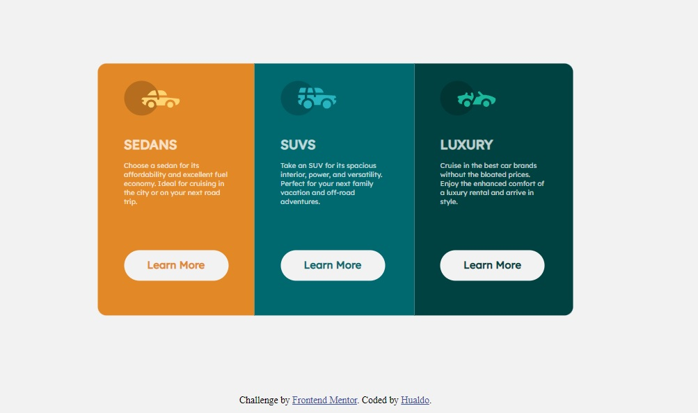

# Frontend Mentor - 3-column preview card component solution

This is a solution to the [3-column preview card component challenge on Frontend Mentor](https://www.frontendmentor.io/challenges/3column-preview-card-component-pH92eAR2-). Frontend Mentor challenges help you improve your coding skills by building realistic projects. 

## Table of contents

- [Overview](#overview)
  - [The challenge](#the-challenge)
  - [Screenshot](#screenshot)
  - [Links](#links)
- [My process](#my-process)
  - [Built with](#built-with)
  - [What I learned](#what-i-learned)
  - [Continued development](#continued-development)
  - [Author](#author)

## Overview

- With this project I could aply my knowledge about HTML 5 and CSS 3, specially Flexbox.

### The challenge

Users should be able to:

- View the optimal layout depending on their device's screen size
- See hover states for interactive elements

### Screenshot

### Links

- Solution URL:(https://github.com/Hualdop/cardComponent)
- Live Site URL: [Add live site URL here](https://hualdop.github.io/cardComponent/)

## My process

- I am a beginner in web developer, at this moment I have a goog knowledge about HTML CSS and Flexbox.

### Built with

- Semantic HTML5 markup
- CSS custom properties
- Flexbox
- Mobile-first workflow

### What I learned

I´m improving my knowledge in Flexbox.

### Continued development

I´d like to learn about Grid

## Author

- Website - [hualdo](https://hualdop.github.io/Hualcap/)
- Frontend Mentor - [@Hualdop](https://www.frontendmentor.io/profile/Hualdop)
- Twitter - [@Hualdos](https://www.twitter.com/hualdos)

